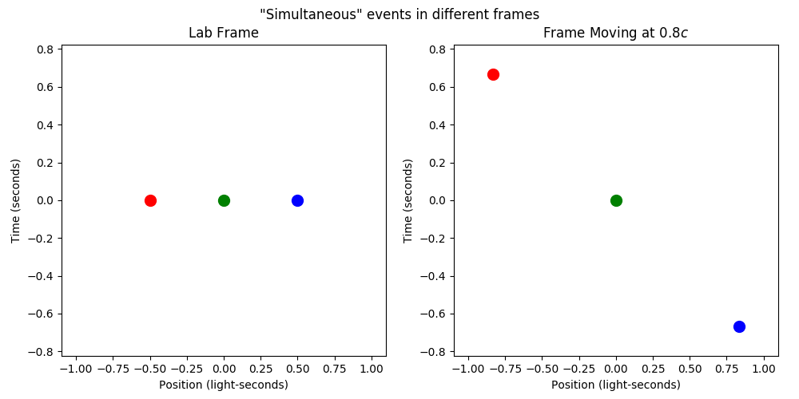
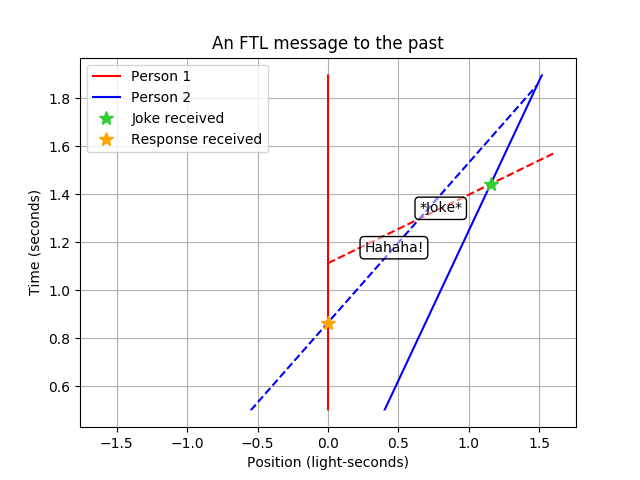
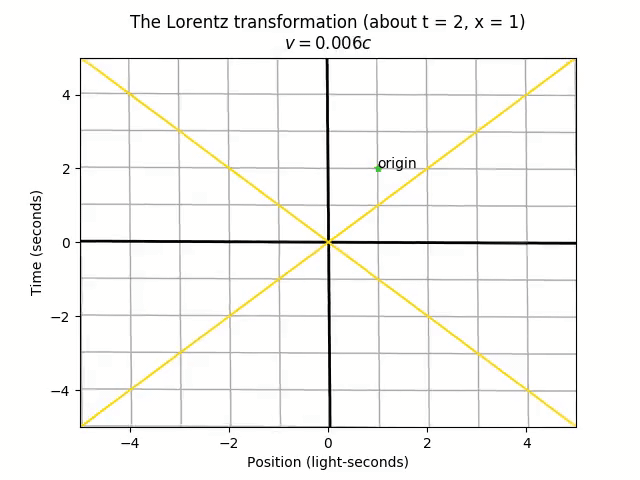
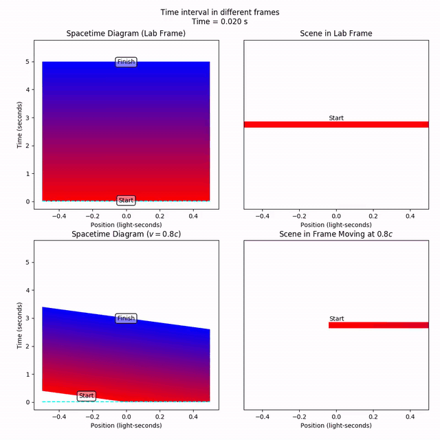
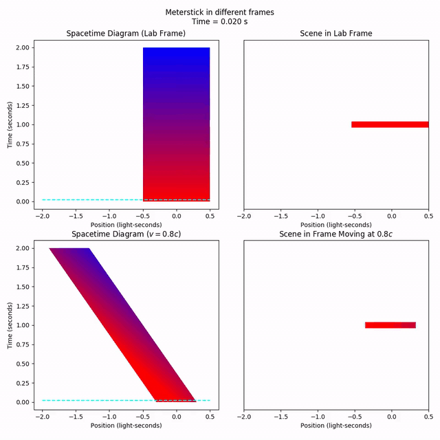
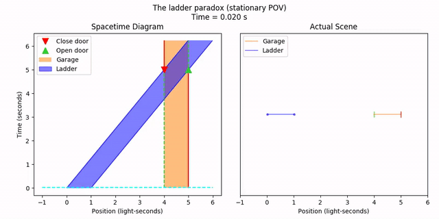
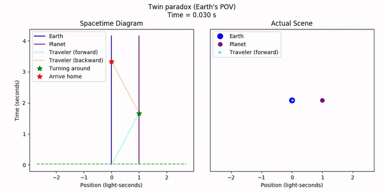

# Special Relativity

The `specrel` package is a Python 3 sandbox tool for understanding basic concepts in special relativity. Easily set up relativistic systems, perform Lorentz transformations, and create plots and animations through a relatively (get it?) simple API.

# At a Glance
### Spacetime Plots
#### The Relativity of Simultaneity

#### Faster-Than-Light Communication

### Lorentz Transformations

### Simple Spacetime Animations
#### Time Dilation

#### Length Contraction

### Sequential, Multi-Part Spacetime Animations
#### The Ladder Paradox

#### The Twin Paradox

# Dependencies

- [Matplotlib](https://matplotlib.org/) for plot generation
- [FFmpeg](https://ffmpeg.org/) for video file writing (for saving animations)

# Installation
The `specrel` package is meant for simple and/or interactive use. To "install", first check the package dependencies. Then, simply place the `specrel` package directory wherever you want to use it, or manually add the containing directory to the Python path (for example, with `sys.path.append`).

# Usage
- For a walkthrough of how to use this package, see the [guided tour](docs/guided_tour/README.md).
- For general documentation, see [docs](docs).
- For example code, see [examples](examples).

# Acknowledgements

The visualization tools in this project are somewhat inspired by [MinutePhysics's "Intro to Special Relativity" Course](https://www.youtube.com/playlist?list=PLoaVOjvkzQtyjhV55wZcdicAz5KexgKvm); the animated spacetime diagrams and Lorentz transformation animators in `specrel` serve a similar purpose to the "spacetime globe" (which is just an interactive spacetime diagram) employed throughout the course.

Knowledge of the details of special relativity comes from my own undergraduate education in physics.