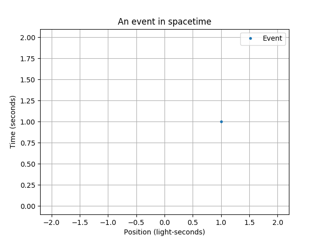

[**Next: Objects in Spacetime**](2-objects.md)

# 1. Spacetime Fundamentals

### Features Introduced
- The `geom.LorentzTransformable` type, and one example, the `geom.STVector`
- The `LorentzTransformable.draw_options` attribute
- The`spacetime.stgrid` function
- Spacetime diagrams using `visualize.stplot`
    - Plotter objects

---

The `specrel` package is a tool for drawing and animating objects in **spacetime**. More specifically, "(1+1)-D" spacetime, which means one dimension of time and one dimension of space.

Before we make any plots, let's make the necessary imports.

```python
# Core geometry objects
import specrel.geom as geom
# Common spacetime objects
import specrel.spacetime as st
# Visualization tools
import specrel.visualize as vis
```

The simplest type of graphic is called a **spacetime diagram** (also known as a "Minkwoski diagram" or "worldline diagram"), which plots time on the vertical axis and position on the horizontal axis. Each horizontal slice of a spacetime plot represents where objects are at that instant in time.

To start simple, let's plot a simple grid. First, we need to create a spacetime grid object ranging from -5 to 5 on both axes. Time is plotted in seconds, while position is plotted in light-seconds.

```python
tlim = (-5, 5)
xlim = (-5, 5)
stgrid = st.stgrid(tlim, xlim)
```

The variable `stgrid` now holds an object of the type `LorentzTransformable`. These are objects that can be plotted and animated in spacetime, as well as manipulated according to the rules special relativity. For now let's just plot it on a normal spacetime diagram.

```python
plotter = vis.stplot(stgrid,
    title='Spacetime diagram\n(Also known as "Minkowski" or "Worldline" diagram)',
    lim_padding=0)
```

The `stplot` function will plot a simple spacetime diagram. Here we've specified a title, and for there to be no extra space to be padded onto our specified axis ranges. It returns a *plotter* object. Plotter objects can do two things: `save` a plot to an image file, or interactively `show` a plot as you run a script. Let's do both.

```python
plotter.save('1-spacetime_grid.png')
plotter.show()
```


That's our first plot! It's just empty space though; let's actually plot a *thing* in spacetime.

An **event** is a thing that happens at a specific time and place. Geometrically, it's just a point in a spacetime diagram, typically denoted as (t, x). Let's make the point (1, 1), which perhaps represents a flash that happens at a distance of one light-second to our right, one second after a designated starting time.

```python
event = geom.STVector(1, 1, draw_options={'label': 'Event'})
```

The `event` variable now holds an `STVector`, a `LorentzTransformable` that represents a point in spacetime. We've given it the label "Event", which will appear on our plots if we enable a legend. More generally, all `LorentzTransformable` objects have a `draw_options` property, which is a dictionary that can contain standard matplotlib plotting specifications associated with the object, such as the color or the marker type.

Now, let's plot it with a background grid and a legend.

```python
# Use new axis limits
tlim = (0, 2)
xlim = (-2, 2)
plotter = vis.stplot(event, title='An event in spacetime',
    tlim=tlim, xlim=xlim, grid=include_grid, legend=include_legend)
plotter.save('1-spacetime_event.png')
plotter.show()
```


---

To summarize, the general flow of things creating a plot is:

1. Create some kind of `LorentzTransformable` object
2. Set up a *plotter* (and later, an *animator*) with the object of interest.
3. Save and/or show the plot.

Next, we'll look at the different types of plottable objects, and some different types of plots and animations that we can make.

[**Next: Objects in Spacetime**](2-objects.md)