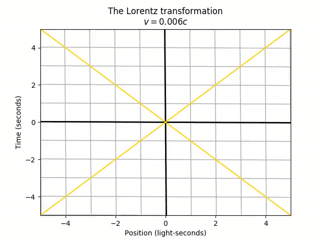
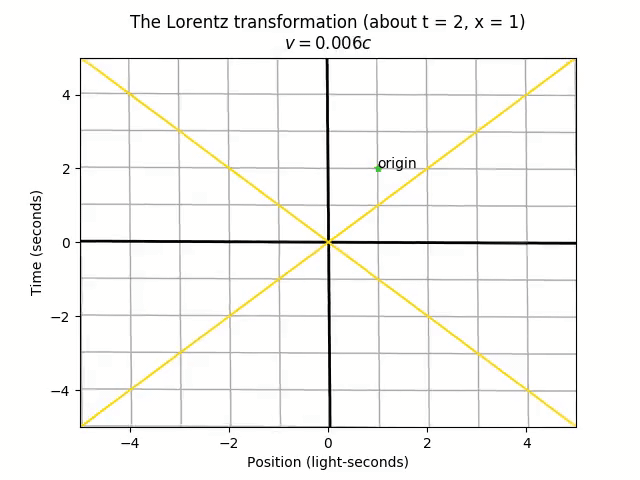
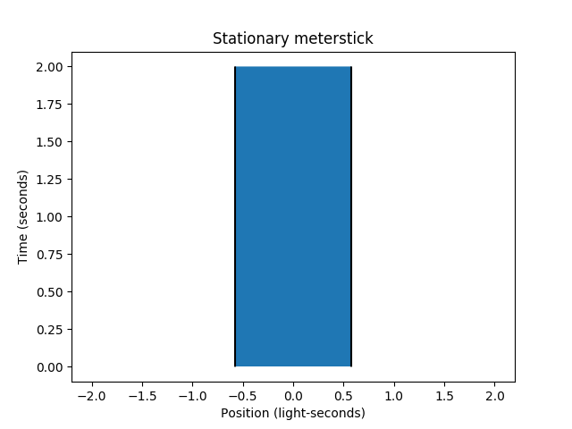
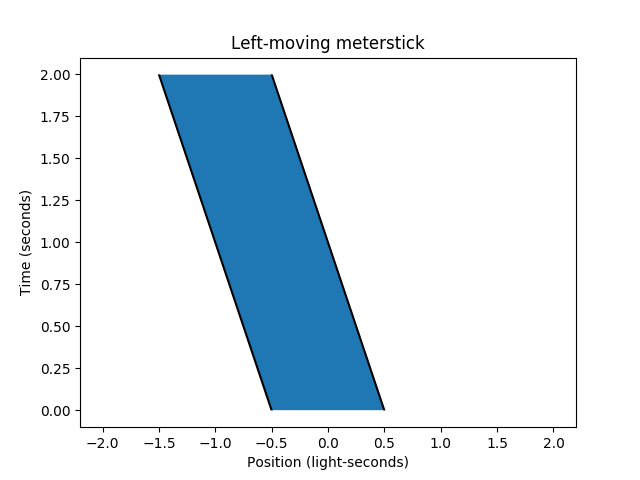

[Previous: Objects in Spacetime](2-objects.md) | [Next: Simultaneity](4-simultaneity.md)
--- | ---

# 3. Lorentz Transformations

### Features Introduced
- Lorentz transforming objects with `LorentzTransformable.lorentz_transform` and `geom.lorentz_transformed`
- Lorentz transformation animations with `visualize.animate_lt`

---

If you know the spacetime coordinates (t, x) of a *thing*, then from your perspective, that *thing* happens at a known time and place. But from the perspective of someone moving relative to you at a velocity *v*, the *thing* happens at a *different* time and place (t', x'). The **Lorentz transformation** takes you from the spacetime coordinates (t, x) in *your* perspective to the spacetime coordinates (t', x') in the *other person's* perspective.

The actual equations can be derived from reasonable physical postulates. This package takes these as a *given*, and allows you to observe the *consequences* of the Lorentz transformation.

We can apply the Lorentz transformation to any `LorentzTransformable` object, so let's start with just seeing the effect on the spacetime grid (lines of constant time and space) as we accelerate from rest (v = 0) to 60% the speed of light. Let's also add diagonal lines representing objects moving at the speed of light in both directions, for future reference.

```python
tlim = (-5, 5)
xlim = (-5, 5)
# Draw more lines than needed right now; they will appear once we transform
stgrid = st.stgrid([2*t for t in tlim], [2*x for x in xlim])
light_draw_options = {'color': 'gold'}
left_light = st.MovingObject(0, velocity=-1, draw_options=light_draw_options)
right_light = st.MovingObject(0, velocity=1, draw_options=light_draw_options)
grid_with_light = geom.Collection([stgrid, left_light, right_light])

v = 3/5
anim = visualize.animate_lt(grid_with_light, v, tlim=tlim, xlim=xlim,
    lim_padding=0, title='The Lorentz transformation')
anim.save('3-lorentztransform.mp4')
anim.show()
```


There's only one point that doesn't move in the transformation: the origin (t = 0, x = 0). This is actually arbitrary. The choice of origin is the one specific spacetime point that both frames agree on. The universe doesn't actually care *which* time we call "t = 0" and *which* position we call "x = 0", so we could just as well set the "center" of the stretching and squeezing from the Lorentz transformation to be at the point (t = 2, x = 1).

```python
origin = geom.STVector(2, 1, tag='origin',
    draw_options={'marker': '*', 'color': 'limegreen'})
grid_with_light.append(origin)
anim = visualize.animate_lt(grid_with_light, v, origin=origin,
    tlim=tlim, xlim=xlim, lim_padding=0,
    title='The Lorentz transformation (about t = 2, x = 1)')
anim.save('3-lorentztransform_origin.mp4')
anim.show()
```


Notice that now the point tagged as "origin" stays still during this transformation. However, the stretching and squeezing still happens the same way, such that any pair of two spacetime points end up with the same separation, regardless of the choice of origin. The only difference is the absolute location on the spacetime diagram.

---

Other than animating the Lorentz transformation, we can also just transform spacetime objects between frames as we please. For example, let's transform the meterstick from last module into the frame where it appears to be stationary.

```python
tlim = (0, 2)
xlim = (-2, 2)
meterstick = st.MovingObject(-1/2, length=1, velocity=1/2)
meterstick_copy = geom.lorentz_transformed(meterstick, 1/2)
p = vis.stplot(meterstick_copy, tlim=tlim, xlim=xlim,
    title='Stationary meterstick')
p.save('3-lorentztransform_stationary_meterstick.png')
p.show()
```


The `geom.lorentz_transformed` function returns a *Lorentz-transformed copy* of a `LorentzTransformable`, similar to how Python's built-in `sorted` function gives a sorted copy of a collection. In a similar vein to the mutating `list.sort` method in Python, there is also the `LorentzTransformable.lorentz_transformed` method that mutates a `LorentzTransformable` object in place, rather than copying.

```python
meterstick.lorentz_transform(4/5)
p = vis.stplot(meterstick, tlim=tlim, xlim=xlim,
    title='Left-moving meterstick')
p.save('3-lorentztransform_reversed_meterstick.png')
p.show()
```


---

The Lorentz transformation is great and all, but in the next few modules, let's look more closely at the *tangible* physical consequences of the Lorentz transformation.

[Previous: Objects in Spacetime](2-objects.md) | [Next: Simultaneity](4-simultaneity.md)
--- | ---