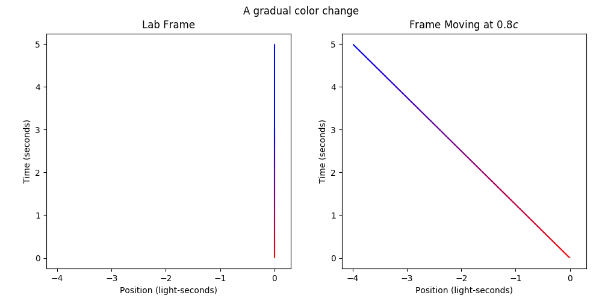
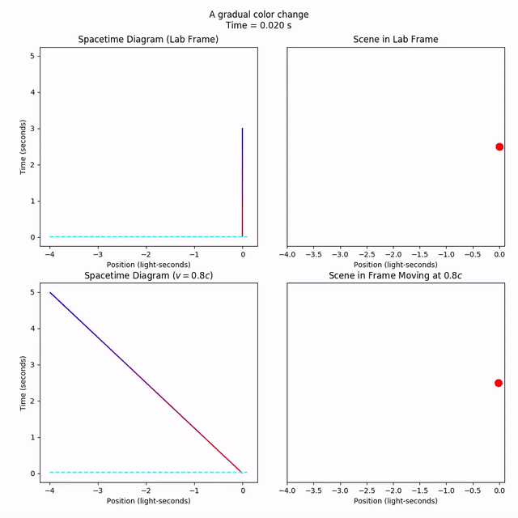
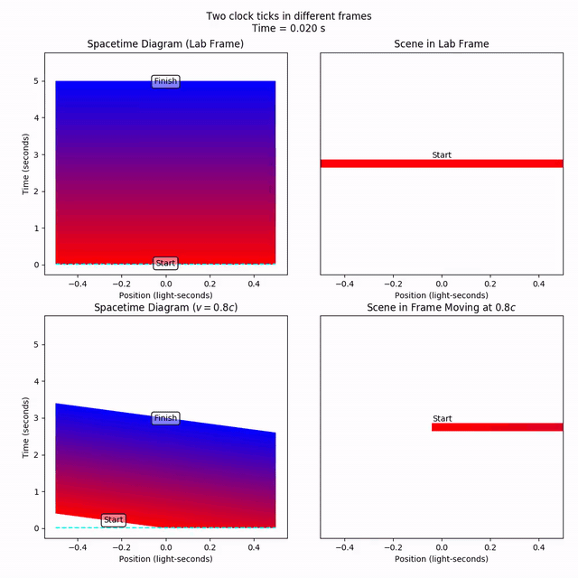
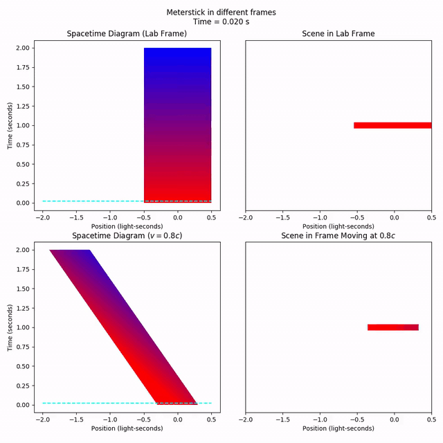

[**Previous: Simultaneity**](4-simultaneity.md) | [**Next: Velocity Addition**](6-velocityaddition.md)

# 5. Time Dilation and Length Contraction

### Features Introduced
- The `spacetime.gradient` gradient objects:
    - `gradient_line`
    - `lateral_gradient_ribbon`
    - `longitudinal_gradient_ribbon`
- The `geom` "half" objects:
    - `Ray`
    - `HalfRibbon`
- The `LorentzTransformable.tag` attribute

## Time Dilation

Let's say that we have a light at x = 0 that gradually changes color from red to blue. What does this look like from a frame moving at 80% the speed of light?

Continuous color gradients are a convenient way to track gradual changes throughout spacetime. The `spacetime.gradient` module contains utilities for forming various gradient objects.

```python
import specrel.spacetime.gradient as grad
```

We can use the `gradient_line` function to fully track the "progress" of an event over time as it proceeds, and how the progression of an event varies from frame to frame. A `gradient_line` is just a `Collection` of line segments (`PointGroup` objects), with `Ray` objects at the front and back. A `Ray` is like a `Line`, but only infinite in one direction.

```python
duration = 3
v = 4/5
# The color change starts at (t = 0, x = 0), and ends at (t = 3, x = 0)
colorchange = grad.gradient_line((0, 0), (duration, 0), 'red', 'blue')
# Set the limits with the magic of foresight
tlim = (0, 5/3*duration)
xlim = (-5/3*duration*v, 0.1)
title = 'A gradual color change'
plotters = vis.compare_frames(colorchange, v, tlim=tlim, xlim=xlim,
    title=title, marker='None')
p = plotters[0]
p.save('5-timedilation_full.png')
p.show()
```


Our line will turn blue and then *stay* blue for eternity (it is also red for eternity until t = 0). This makes it a bit hard to see when the color change actually starts and ends, so let's `pop` the ends of the `Collection`. Then, we can animate cleanly.

```python
pre = colorchange.pop(0)
post = colorchange.pop()
markersize = 20
anim = vis.compare_frames_animated_with_worldline(colorchange, v,
    tlim=tlim, xlim=xlim, markersize=markersize, title=title,
    current_time_color='cyan')
anim.save('5-timedilation.mp4')
anim.show()
```


Notice how the change of color takes 3 seconds in the lab frame, and 5 seconds in the moving frame? That's **time dilation**. The same "event" (the signal fully changing from red to blue) appears to take longer when it's moving, so we say *time moves slower in moving frames*.

Curiously, if we had started in "moving" frame with a 3-second color changing point at x = 0, and then transformed to the "lab" frame, we would say that time were dilated in the *lab frame*. So whose time is dilated? Is this not a paradox? I'll leave that to you to puzzle out. It has to do with the disagreement on what's "synchronized" between different frames.

There's another equivalent way to view time dilation. Instead of looking at a single localized event, let's look at *the progression of time itself* across space. To do this, we can treat a time value as a horizontal line in a spacetime diagram. At t = 0, the "t = 0"-ness is experienced at every x value.

We can track the progress of these instants of time across all space using the `lateral_gradient_ribbon`. Like the `gradient_line`, it's a `Collection`, but this time is composed of lines of gradually changing color. Let's track an interval of time that starts at t = 0 (red) and ends at t = 5 (blue). So five seconds of time in the lab frame.

```python
duration = 5
# The two boundary lines have a direction vector (t = 0, x = 1), and the bottom
# and top boundaries pass through (t = 0, x = 0) and (t = 5, x = 0),
# respectively
onesecond = grad.lateral_gradient_ribbon((0, 1), (0, 0), (duration, 0),
    'red', 'blue')
```

For clarity, let's tag the start and end of the time interval as "start" and "finish". These will be overlaid when we plot the scene.

```python
onesecond[0].tag = 'Start'
onesecond[-1].tag = 'Finish'
tlim = (0, duration + 0.5)
xlim = (-0.5, 0.5)
anim = vis.compare_frames_animated_with_worldline(onesecond, v,
    tlim=tlim, xlim=xlim, instant_pause_time=0, linewidth=10,
    title='Time interval in different frames', current_time_color='cyan')
anim.save('5-timedilation2.mp4')
anim.show()
```


Notice how the lines of constant time have desynchronized in the moving frame, as we know should happen. At x = 0, the time interval starts at t = 0, but at x = -0.5, the interval starts a little later, at t = 0.4. But never mind that. Let's just fix our attention to x = 0 (a vertical line through the middle of the spacetime diagram). We can imagine this is where the moving observer sits, experiencing the passage of time.

Notice that the time interval starts at t = 0, and finishes at t = 3. So, a period of five seconds in the lab frame is experienced as only *three* seconds by the moving observer. A person in the lab frame has aged five seconds, while the moving observer has aged by three; time is dilated for the moving observer.

# Length Contraction

Let's say that we have a stationary meterstick of length one (in light-seconds, so it's actually a "light-second-stick"). What does it look like from a frame moving at 80% the speed of light?

A stationary meterstick exists across a range of positions of length one, and across *all time* (an object doesn't just disappear, after all). Time and space are mixed together by the Lorentz transformation, so to keep track of the *lab frame's* "past" and "future", let's color-code the spacetime diagram; red means farther in the past, and blue means farther in the future.

We can track an object as it moves through time using the `longitudinal_gradient_ribbon`. Like the `lateral_gradient_ribbon`, it's a `Collection`, but this time is composed of polygons of changing color, and capped off at the front and back by `HalfRibbon` objects. These "half-infinite" `Ribbons`, in the same sense that `Rays` are "half-infinite" `Lines`.

```python
meterstick = phy.MovingObject(-0.5, 1)
tlim = (0, 2)
xlim = (-2, 0.5)
meterstick = grad.longitudinal_gradient_ribbon(
    [(tlim[0], meterstick.left_pos(tlim[0])),
        (tlim[1], meterstick.left_pos(tlim[1]))],
    [(tlim[0], meterstick.right_pos(tlim[0])),
        (tlim[1], meterstick.right_pos(tlim[1]))],
    'red', 'blue'
)
anim = vis.compare_frames_animated_with_worldline(meterstick, v,
    tlim=tlim, xlim=xlim, title='Meterstick in different frames',
    instant_pause_time=0, linewidth=10, current_time_color='cyan')
anim.save('5-lengthcontraction.mp4')
anim.show()
```


If we look at a fixed time *in the moving frame*, the meterstick appears to be 0.6 light-seconds long; shorter than it was when it was at rest, so we say *moving objects appear shorter*. Notice how a "fixed time" in the moving frame is *not* the same set of points as a "fixed time" in the lab frame. The fixed-time measurement made in the moving frame involves spacetime points from the *lab frame's past* on the left and the *lab frame's future* on the right.

[**Previous: Simultaneity**](4-simultaneity.md) | [**Next: Velocity Addition**](6-velocityaddition.md)