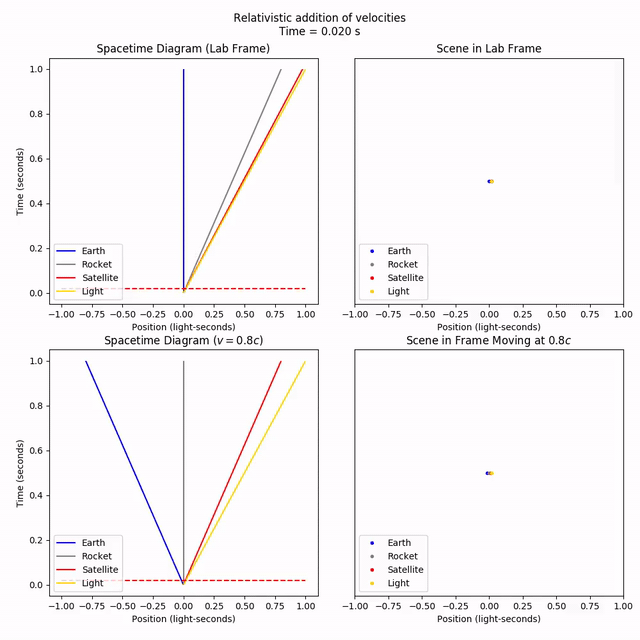
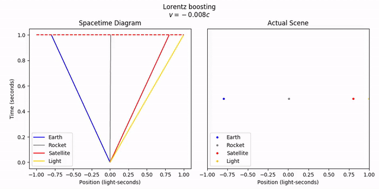

**[Previous: Time Dilation and Length Contraction](5-dilationcontraction.md) | [Next: Faster-than-light Travel](7-ftl.md)**

# 6. Velocity Addition

### Features Introduced
- Lorentz boosting objects with `LorentzTransformable.lorentz_boost` and `geom.lorentz_boosted`
- More Lorentz transformation animations with `visualize` functions `animate_lt_realspace` and `animate_lt_worldline_and_realspace`

---

Let's say a rocketship, moving at 80% the speed of light relative to an observer on Earth, launches a satellite, moving 80% the speed of light relative to relative to the rocketship. In other words, what happens when we "add" the velocities (80% speed of light) + (80% speed of light)? Will Earth observe a satellite travelling 160% the speed of light?

Let's find out. Start out with both the rocket and satellite moving together at 80% the speed of light. The Earth is stationary. Let's also add a light ray for reference.

```python
v = 4/5
earth = st.MovingObject(0,
    draw_options={'label': 'Earth', 'color': 'blue'})
rocket = st.MovingObject(0, velocity=v,
    draw_options={'label': 'Rocket', 'color': 'gray'})
satellite = st.MovingObject(0, velocity=v,
    draw_options={'label': 'Satellite', 'color': 'red'})
light = st.MovingObject(0, velocity=1,
    draw_options={'label': 'Light', 'color': 'gold'})
```

We can "boost" the satellite by an extra 80% the speed of light using the `LorentzTransformable.lorentz_boosted` method. There's also the `geom.lorentz_boosted` function for making boosted copies, similarly to the `geom.lorentz_transformed` function.

```python
satellite.lorentz_boost(v)
```

Now let's compare what Earth sees (the lab frame) against what the rocket sees.

```python
tlim = (0, 1)
xlim = (-1, 1)
anim = vis.compare_frames_animated_with_worldline(objects, v, tlim=tlim,
    xlim=xlim, title='Relativistic addition of velocities',
    legend=True, legend_loc='lower left')
anim.save('6-velocityaddition.mp4')
anim.show()
```


As we can see from the rocket's frame, the satellite is indeed fired off at a relative speed of 80% the speed of light. But from the lab frame, the satellite velocity has only gone up by a little bit, inching towards the speed of light but not quite reaching it.

If we start from the rocket's frame, and animate the transformation to the lab frame, we can see this more clearly. Let's watch both the spacetime diagram and the objects in real space if we fix the time to t = 1. To reiterate, fixing t = 1 across frames is sort of meaningless, but it still looks cool.

```python
objects.lorentz_transform(v)
anim = vis.animate_lt_worldline_and_realspace(objects, -v,
    tlim=tlim, xlim=xlim, title='Lorentz boosting',
    legend=True, legend_loc='lower left', time=tlim[1])
anim.save('6-velocityaddition_boost.mp4')
anim.show()
```


**[Previous: Time Dilation and Length Contraction](5-dilationcontraction.md) | [Next: Faster-than-light Travel](7-ftl.md)**