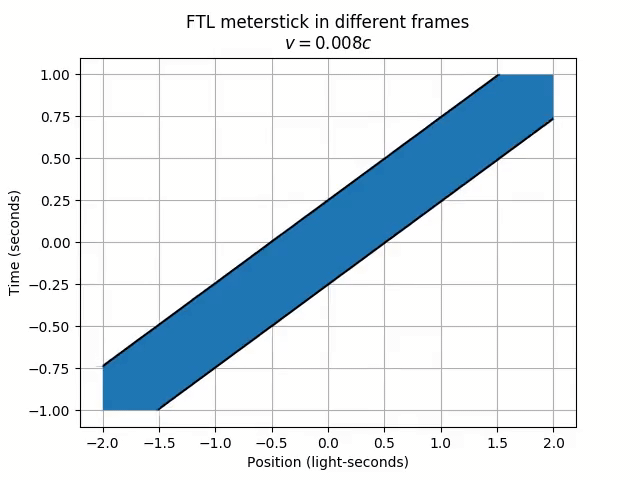
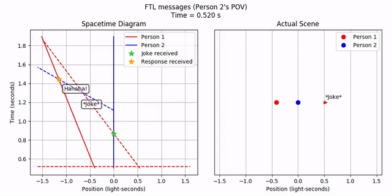
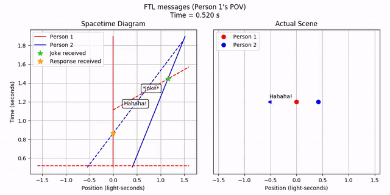
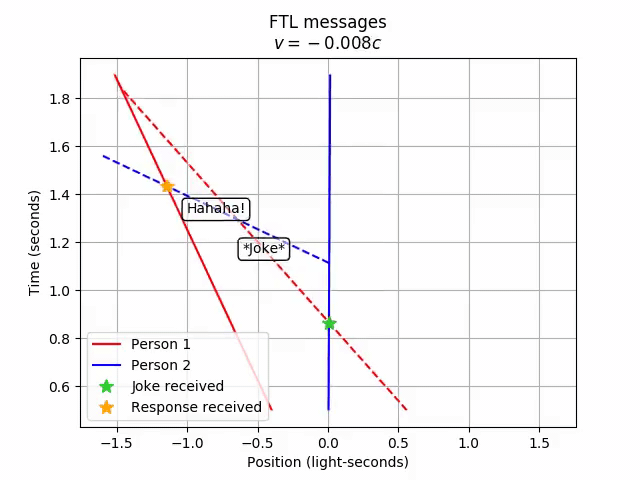

[Previous: Velocity Addition](6-velocityaddition.md) | [Next: Ladder Paradox](8-ladderparadox.md)
--- | ---

# 7. Faster-than-light Travel

### Features Introduced
- Utility methods of `spacetime.MovingObject` and `geom.Line`

---

As we've seen, it's impossible to boost something to move faster than light (FTL), but what if you could? What would the consequences be? Let's create an FTL meterstick, moving at twice the speed of light, and see what happens as we transform to a frame moving at 80% the speed of light.

```python
v_ftl = 2
v_frame = 4/5
meterstick = st.MovingObject(-0.5, 1, velocity=v_ftl)
tlim = (-1, 1)
xlim = (-2, 2)
include_grid = True
anim = vis.animate_lt(meterstick, v_frame, tlim=tlim, xlim=xlim,
    title='FTL meterstick in different frames', grid=include_grid)
anim.save('7-ftl_meterstick.mp4')
anim.show()
```


Strange things are happening! Firstly, the meterstick moves to the right in the lab frame, but left in the frame moving at 80% the speed of light. Odd, since we wouldn't overtake the FTL meterstick if we only moved at 80% the speed of light. Secondly, and perhaps more worryingly, in a frame moving at half the speed of light, the meterstick has grown to an infinite length! Furthermore, different parts of the meterstick (like the right end and the left end) never appear at the same time!

---

Faster-than-light communication also allows for *violations of causality*. To see how, let's consider the following scenario.

Somehow, faster-than-light communication technology has been developed, and two people are having a conversation through FTL messages. Person 1 is stationary, in what we'll call the "lab frame." Person 2 is moving at Person 1 starts with a joke: "The bartender says 'We don't serve tachyons in here.' A tachyon walks into a bar." Person 2 responds with: "Hahaha, good joke!"

Let's set up the scenario. Using the power of hindsight, it's easiest to set up this system in a "median" frame, where both Person 1 and Person 2 are moving away from each other at equal speeds. Just trust me on the numbers here. For convenience, make use of the `Line` object's `intersect` method to save us from doing geometry. After everything is set, we can transform to Person 2's frame for plotting.

```python
# Set up this system in the "median" frame
tlim = (0.5, 1.9)
xlim = (-1.6, 1.6)
v_away = 1/2
v_message = 4
t_send = 1
person1 = st.MovingObject(0, velocity=-v_away,
    draw_options={'color': 'red', 'label': 'Person 1', 'markersize': 15})
person2 = st.MovingObject(0, velocity=v_away,
    draw_options={'color': 'blue', 'label': 'Person 2', 'markersize': 15})
# Extensions of the messages to all time, even though they don't exist for all
# time. The lines are useful for intersection calculations
joke_alltime = st.MovingObject(person2.center_pos(t_send), start_time=t_send,
    velocity=-v_message)
# Get the left edge of the MovingObject; since it's a point object it's just
# the worldline
joke_sent = joke_alltime.left().intersect(person1.left())
# The actual joke object to draw
joke = geom.Ray((-1, v_message), joke_sent, tag='*Joke*',
    draw_options={'color': 'red', 'linestyle': '--', 'marker': '>'})
# Mark the point of receipt
joke_received = joke.intersect(person2.left())
joke_received.draw_options = {
    'color': 'limegreen',
    'marker': '*',
    'markersize': 10,
    'label': 'Joke received'
}
# Repeat for the response stuff
response_alltime = st.MovingObject(person1.center_pos(t_send),
    start_time=t_send, velocity=v_message, tag='Hahaha!',
    draw_options={'color': 'blue', 'linestyle': '--', 'marker': '<'})
response_sent = response_alltime.left().intersect(person2.left())
response = geom.Ray((-1, -v_message), response_sent, tag='Hahaha!',
    draw_options={'color': 'blue', 'linestyle': '--', 'marker': '<'})
response_received = response.intersect(person1.left())
response_received.draw_options = {
    'color': 'orange',
    'marker': '*',
    'markersize': 10,
    'label': 'Response received'
}
ftl_convo = geom.Collection([person1, person2, joke, response,
    joke_received, response_received])
# Person 2's perspective
ftl_convo.lorentz_transform(v_away)
```

The numbers work out such that Person 2 sees Person 1 moving away at 80% the speed of light, and vice versa. Both people send FTL messages at 150% the speed of light, from their frames.

So, let's plot it and see what Person 2 sees.

```python
anim = vis.stanimate_with_worldline(ftl_convo, tlim=tlim, xlim=xlim,
    title="FTL messages (Person 2's POV)", grid=include_grid, legend=True,
    legend_loc='upper right')
anim.save('7-ftl_person2.mp4')
anim.show()
```


Person 2 sees the FTL joke, waits a bit, and then sends out an FTL response. This happens *in order*. It's curious how the joke appears to come from the opposite direction from where Person 1 is! But let's ignore that for now. What does Person 1 see?

```python
# Person 1's perspective
ftl_convo.lorentz_transform(-4/5)
anim = vis.stanimate_with_worldline(ftl_convo, tlim=tlim, xlim=xlim,
    title="FTL messages (Person 1's POV)", grid=include_grid, legend=True,
    legend_loc='upper left')
anim.save('7-ftl_person1.mp4')
anim.show()
```


Person 1...receives Person 2's response before they even send out the joke! Hence, *FTL communication leads to violations of causality*.

For fun, let's see how the order of events flips as we transform from Person 2's frame to Person 1's frame.

```python
# Transformation from Person 2 to Person 1
ftl_convo.lorentz_transform(4/5)
anim = vis.animate_lt(ftl_convo, -4/5, tlim=tlim, xlim=xlim,
    title='FTL messages', grid=include_grid, legend=True,
    legend_loc='lower left')
anim.save('7-ftl_messages.mp4')
anim.show()
```


[Previous: Velocity Addition](6-velocityaddition.md) | [Next: Ladder Paradox](8-ladderparadox.md)
--- | ---