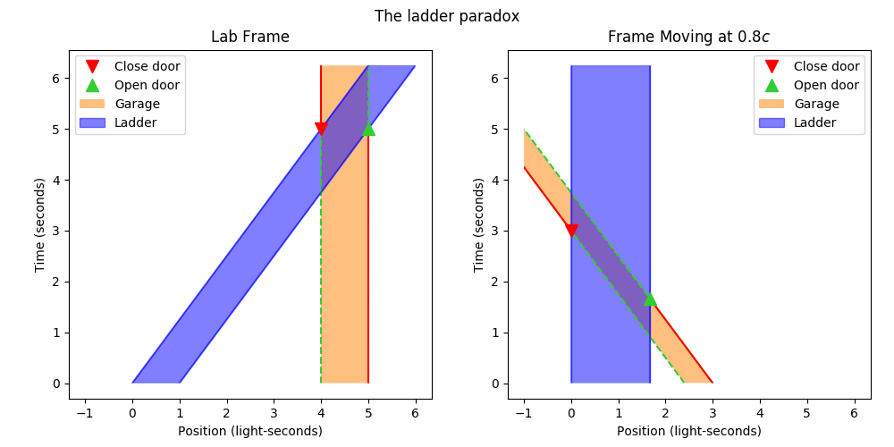
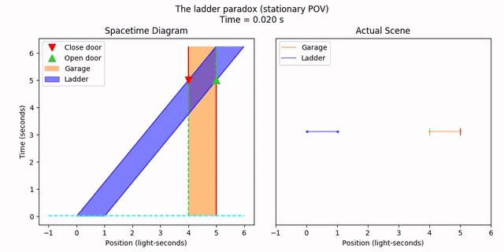

[**Previous: Faster-than-light Travel**](7-ftl.md) | [**Next: Twin Paradox**](9-twinparadox.md)

# 8. Ladder Paradox

### Features Introduced
- The `graphics.companim.Rewinder` class
- The `graphics.companim.concat_demuxer` utility

---

The ladder paradox (also sometimes calld the barn-pole paradox) is a famous problem in special relativity. Say we have a ladder that's just a little longer than a garage, such that is doesn't quite fit. We know that moving objects become shorter, so if we accelerate the ladder to relativistic speeds, it should fit in the garage, at least from the perspective of an observer in the lab frame (where the garage isn't moving).

But say a friend decides to ride with the *ladder*. Then the friend will see the *garage* moving towards the ladder, and so the *garage* will be even shorter than before. If the ladder didn't fit before, it definitely wouldn't fit now.

But how can this be? How can the ladder both fit and not fit in the garage? The resolution is again the disagreement on what events are simultaneous in different frames. Let's set up the scenario to see what happens.

In the lab frame, the ladder and the garage are exactly the same length. The ladder is approaching the garage from the left at 80% the speed of light.

```python
# Ladder information
v = 4/5
ladder_left_start = 0
ladder_length = 1
alpha = 0.5 # For transparency
ladder = st.MovingObject(ladder_left_start, ladder_length, v,
    draw_options={'color': (0, 0, 1, alpha), 'label': 'Ladder'})

# Garage information
garage_left_start = 4
garage = st.MovingObject(garage_left_start, ladder_length,
    draw_options={
        'facecolor': (1, 0.5, 0, alpha),
        'edgecolor': 'limegreen',
        'label': 'Garage',
    }
)
# Add a few more frills to the drawing
door_draw_options = {'linestyle': '--', 'marker': '|', 'markersize': 10}
garage[0].draw_options = door_draw_options
garage[1].draw_options = door_draw_options
```

At first, we have the left door of the garage open and the right door closed. At the instant when the ladder is perfectly inside the garage, we close the left door and open the right door (you can imagine the opening of the right door is a little bit after the closing of the left door).

```python
# Time range
t_start = 0
# End when the ladder totally clears the garage
t_end = ladder.time_for_left_pos(garage.right_pos(0))
# Time when the garage doors are opened/closd
t_transition = ladder.time_for_left_pos(garage.left_pos(0))

# Whole period when each door is closed
closed_draw_options = {'color': 'red', 'marker': '|', 'markersize': 10}
left_closed = geom.Ray((1, 0), (t_transition, garage.left_pos(0)),
    draw_options=closed_draw_options)
right_closed = geom.Ray((-1, 0), (t_transition, garage.right_pos(0)),
    draw_options=closed_draw_options)

# Exact event of closing/opening each door
close_event_draw_options = {
    'color': 'red',
    'marker': 'v',
    'markersize': 10,
    'label': 'Close door',
}
open_event_draw_options = {
    'color': 'limegreen',
    'marker': '^',
    'markersize': 10,
    'label': 'Open door',
}
left_close_event = geom.STVector(t_transition, garage.left_pos(t_transition),
    draw_options=close_event_draw_options)
right_open_event = geom.STVector(t_transition, garage.right_pos(t_transition),
    draw_options=open_event_draw_options)
```

So, what happens in the lab frame and the ladder's frame?

```python
# Synthesize the scene
scene = geom.Collection([
    garage, ladder,
    left_closed, right_closed,
    left_close_event, right_open_event,
])

tlim = (t_start, t_end)
xlim = (ladder_left_start - ladder_length, ladder.right_pos(t_end))

# Plot the frames
legend = True
p = vis.compare_frames(scene, v, tlim=tlim, xlim=xlim, legend=legend,
    title='The ladder paradox')
p[0].save('8-ladderparadox.png')
p[0].show()
```


As we can see, the ladder appears to fit in the garage in the lab frame, but most definitely does *not* fit in the garage in the ladder's frame. What gives?

Well, what do we mean by "the ladder fit in the garage"? We mean that there was some instant in time when we had both doors closed, with the ladder in between them. And this is true in the lab frame. But in the ladder's rest frame, we have a different story of what happened. Here, the doors were actually *never* closed at the same time. Instead, the right door was opened first, the ladder was pushed through a little bit until its left end cleared the left door of the garage, and *then* the left door was closed. So the ladder didn't *actually* fit; the "proof" in the lab frame is somehow faulty in the moving frame. One might imagine the two friends arguing; the one moving with the ladder would be annoyed at the one by the garage for not manning the doors properly, and the garage-master would insist that they did things right. In fact, both of them are right; simultaneity is frame-dependent.

Let's animate the two scenarios back-to-back this time, rather than together, since the idea of "synchronized time" isn't meaningful anyway. We need to animate each leg of the movie separately. First, we do the animations in each frame separately.

```python
# Animate the lab frame
fps = 50
lab_fname = '8-ladderparadox_stationary.mp4'
anim_lab = vis.stanimate_with_worldline(scene, tlim=tlim, xlim=xlim,
    fps=fps, legend=True, legend_loc='upper left',
    title='The ladder paradox (stationary POV)')
anim_lab.save(lab_fname)
# Animate the ladder frame
ladder_fname = '8-ladderparadox_ladder.mp4'
anim_ladder = vis.stanimate_with_worldline(geom.lorentz_transformed(scene, v),
    tlim=tlim, xlim=xlim, fps=fps, legend=True, legend_loc='upper right',
    title='The ladder paradox (ladder POV)')
anim_ladder.save(ladder_fname)
```

Then, we animate the transformation from the lab frame to the moving frame.

```python
# Animate the transformation
lt_fname = '8-ladderparadox_transform.mp4'
anim_lt = vis.animate_lt_worldline_and_realspace(scene, v,
    tlim=tlim, xlim=xlim, fps=fps, legend=True, title='Transforming frames...')
anim_lt.save(lt_fname)
```

Lastly, let's add a "rewind" transition to go between the end of the first frame's part to the transformation. The `graphics.companim` module has a class called `Rewinder` for this purpose. We just need to give it the animator we want to rewind. Let's also rewind quickly, at five times the original animation speed. By default a one-second delay is added at the front and back of the rewind animation, to give a little space between the other animations.

```python
import specrel.graphics.companim as canim
# Animate the rewind from the lab frame
rew_fname = '8-ladderparadox_rewind.mp4'
anim_rew = canim.Rewinder(anim_lab, rewind_rate=4)
anim_rew.save(rew_fname)
```

Those are all the components. All that remains it to bind the animation together into one file. We can do that with `concat_demuxer`, also in `graphics.companim`. We just provide a list of input file names, and an output file name to write to.

```python
canim.concat_demuxer([lab_fname, rew_fname, lt_fname, ladder_fname],
    '8-ladderparadox.mp4')
```


[**Previous: Faster-than-light Travel**](7-ftl.md) | [**Next: Twin Paradox**](9-twinparadox.md)