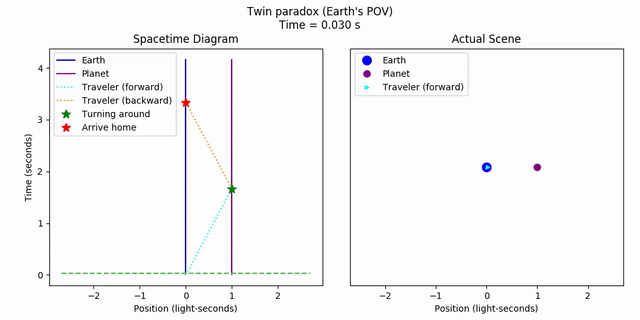

[**Previous: Ladder Paradox**](8-ladderparadox.md) | [**Return to Main Page**](README.md)

# 9. Twin Paradox

### Features Introduced
- More utility methods of `spacetime.MovingObject`
- The `geom.STVector.gamma_factor` function

---

The twin paradox is perhaps the most famous paradox in special relativity. We know about time dilation; moving clocks run slow. We also know that there is no preferred frame of reference. It's equally acceptable to say that A is stationary while B moves to the right, as it is to say that A moves to the left while B is stationary.

Consider the following scenario about two twins. Twin A stays on Earth. Twin B flies on a spaceship to a nearby planet at 60% the speed of light, then turns around and flies back home at the same speed. From the perspective of Earth, we would say that twin B has aged less than twin A due to time dilation from the round trip. And this is exactly what happens.

But what about from twin B's perspective? They would see *Earth* moving away from them, then turning around and coming back. So why isn't it *twin A* that has aged less? Didn't we just assert that there is no preferred frame of reference?

To make things clear, let's plot the scenario. First, the planets.

```python
origin = 0
planetdist = 1
x_planet = origin + planetdist
earth = st.MovingObject(origin,
    draw_options={'color': 'blue', 'markersize': 20, 'label': 'Earth'})
planet = st.MovingObject(x_planet,
    draw_options={'color': 'purple', 'markersize': 15, 'label': 'Planet'})
```

Next, the traveling rockets. Note that since the twin had to turn around, we need two separate lines to represent the trip. Again, we'll use the `MovingObject`'s geometry capabilities to calculate the necessary points, this time for `line_segments`.

```python
v = 3/5
rocket_forward_alltime = st.MovingObject(origin, velocity=v)
t_turnaround = rocket_forward_alltime.time_for_left_pos(x_planet)
rocket_forward = geom.line_segment((0, 0), (t_turnaround, x_planet),
    draw_options={
        'color': 'cyan',
        'marker': '>',
        'markersize': 5,
        'linestyle': ':',
        'label': 'Traveler (forward)',
    }
)
rocket_backward_alltime = st.MovingObject(origin + 2*planetdist, velocity=-v)
t_return = rocket_backward_alltime.time_for_left_pos(origin)
rocket_backward = geom.line_segment((t_turnaround, x_planet), (t_return, 0),
    draw_options={
        'color': 'darkorange',
        'marker': '<',
        'markersize': 5,
        'linestyle': ':',
        'label': 'Traveler (backward)',
    }
)
```

Lastly, let's mark the turnaround and return events, then collect the scene.

```python
turnaround_event = geom.STVector(t_turnaround, x_planet,
    draw_options={
        'color': 'green',
        'marker': '*',
        'markersize': 10,
        'label': 'Turning around',
    }
)
return_event = geom.STVector(t_return, origin,
    draw_options={
        'color': 'red',
        'marker': '*',
        'markersize': 10,
        'label': 'Arrive home',
    }
)

# Collect scene
scene = geom.Collection([
    earth, planet,
    rocket_forward, rocket_backward,
    turnaround_event, return_event,
])
```

For the end time, we'll use some foresight and multiply the return time in the lab frame by the *gamma factor*. Now, let's make the same sort of back-to-back animation that we did with the ladder paradox. First, Earth's point of view, rewinding, and the Lorentz transformation to the traveling twin's frame.

```python
tlim = (0, geom.STVector.gamma_factor(v)*t_return)
pad = planetdist/5
xlim = (geom.lorentz_transformed(return_event, v).x - pad,
        geom.lorentz_transformed(return_event, -v).x + pad)

# From Earth's point of view
current_time_color = 'limegreen'
instant_pause_time = 0.5
fps = 100
legend = True
earth_fname = '9-twinparadox_earth.mp4'
anim_earth = vis.stanimate_with_worldline(scene,
    tlim_anim=(0, return_event.t), tlim_worldline=tlim, xlim=xlim,
    legend=legend, legend_loc='upper left', fps=fps,
    title="Twin paradox (Earth's POV)",
    current_time_color=current_time_color,
    instant_pause_time=instant_pause_time)
anim_earth.save(earth_fname)
# Rewind
rew_fname = '9-twinparadox_rewind.mp4'
anim_rew = compg.Rewinder(anim_earth, rewind_rate=5)
anim_rew.save(rew_fname)
# Transformation
lt_fname = '9-twinparadox_transform.mp4'
anim_lt = vis.animate_lt_worldline_and_realspace(scene, v,
    tlim=tlim, xlim=xlim, legend=legend, fps=fps,
    title=f'Transforming frames...',
    current_time_color=current_time_color)
anim_lt.save(lt_fname)
```

The twin's frame itself involves a transformation, since the ship's direction changes halfway through. But no matter; we can still do it.
```python
# From the traveler's point of view during the first half of the journey
scene.lorentz_transform(v)
forward_fname = '9-twinparadox_forward.mp4'
anim_forward = vis.stanimate_with_worldline(scene,
    tlim_anim=(0, turnaround_event.t), tlim_worldline=tlim, xlim=xlim,
    legend=legend, legend_loc='upper right', fps=fps,
    title="Twin paradox (traveler's POV)",
    current_time_color=current_time_color,
    instant_pause_time=instant_pause_time)
anim_forward.save(forward_fname)
# Change directions mid-travel. Set the origin to the twin's current point, so
# that it doesn't change mid-acceleration.
dv = geom.lorentz_transformed(rocket_backward_alltime, v).velocity()
# Time value of the turnaround, within the time resolution of a frame
tval = round(turnaround_event.t * fps) / fps
accel_fname = '9-twinparadox_accel.mp4'
anim_accel = vis.animate_lt_worldline_and_realspace(scene, dv,
    origin=turnaround_event, tlim=tlim, xlim=xlim, legend=legend, fps=fps,
    title=f'Changing direction...\nTime = {tval:.3f}',
    current_time_color='limegreen', time=turnaround_event.t,
    display_current_velocity=False)
anim_accel.save(accel_fname)
# From the traveler's point of view during the second half of the journey
scene.lorentz_transform(dv, origin=turnaround_event)
backward_fname = '9-twinparadox_backward.mp4'
anim_backward = vis.stanimate_with_worldline(scene,
    tlim_anim=(turnaround_event.t, return_event.t), tlim_worldline=tlim,
    xlim=xlim, legend=legend, legend_loc='upper left', fps=fps,
    title="Twin paradox (traveler's POV)",
    current_time_color=current_time_color,
    instant_pause_time=instant_pause_time)
anim_backward.save(backward_fname)
```

Finally, gluing everything together, we get the final animation.

```python
# Glue all the parts together
compg.concat_demuxer([earth_fname, rew_fname, lt_fname,
    forward_fname, accel_fname, backward_fname], '9-twinparadox.mp4')
```


As we can see, in each of the moving frames individually, it appears that the traveling twin should be *older*. However, the twin's acceleration halfway through "brings home closer" in some sense, so the net result is that the traveling twin indeed is younger. Both twins agree. The takeaway here is that while velocities are relative, acceleration is absolute. Since one twin accelerates and the other doesn't, the system isn't symmetric anymore, and the reference frames aren't on even footing.

This is the last demo. I encourage you to dream up your own systems and plot them. This is the best way to develop an understanding and intuition for relativistic scenarios.

[**Previous: Ladder Paradox**](8-ladderparadox.md) | [**Return to Main Page**](README.md)